# Design and Development of a Web-Based Library Reservation and Circulation Management System for IBA College of Mindanao, Inc.

ORTIZ, ALEXANDER L.

TAVITA, SHERLYN BHEL M.

DALAYON, EARL JAYSON B.

GARCIA, JOHN LAURENCE

An Undergraduate System Development Project Presented to the Faculty of the Department of Information Technology, IBA College of Mindanao, Inc., TN Pepito Street, Poblacion, Valencia City, Bukidnon

Bachelor of Science in Information Technology

October 2026

# CHAPTER 1 — INTRODUCTION

## Title

Design and Development of a Web-Based Library Reservation and Circulation Management System for IBA College of Mindanao, Inc.

## Background of the Study

College libraries provide students and teachers with access to printed learning resources. The usefulness of these resources depends not only on the collection but also on the library's ability to identify available copies, record borrowers, manage requests, and monitor the return of materials. A reliable circulation process connects each physical copy with its current status and, when borrowed, the person responsible for returning it.

Manual or disconnected records can require staff to repeat searches, consult several logs, and reconcile borrowing information before answering inquiries or preparing reports. These are potential operational concerns that justify examining the existing process. They are not presented here as measured findings about IBA College of Mindanao, Inc. The institution's actual procedures, frequency of record discrepancies, and transaction times must be established through documented interviews, observation, and authorized record review.

This project addresses library record management through a web-based reservation and circulation system. The application maintains bibliographic records, individual physical copies, library member records, reservations, loans, and audit events. Its principal operating model is staff-managed circulation: students and teachers use verified physical library cards, while authorized personnel record borrowing, returns, and reservation requests. Borrowers do not need an email address or online account to borrow at the circulation desk.

The public catalog allows visitors to search book information and view copy availability and shelf locations without signing in. Librarians manage daily operations, while Administrators additionally manage access roles and circulation settings. Existing linked Member accounts retain personal borrowing and reservation functions for compatibility, but the current application does not offer public account registration. Library membership and online authentication are therefore treated as separate records and processes.

By relating book copies, borrowers, circulation actions, and audit events, the system provides a basis for more consistent records and easier monitoring. Improvements in processing speed, accuracy, and service quality remain expected outcomes until evaluated against a verified baseline. This paper describes the source implementation and its design; it does not claim that deployment or user acceptance has already been completed.

## Problem Statement

The project addresses the need for a centralized process for locating books, identifying eligible borrowers, managing requests for unavailable titles, recording copy-level circulation, monitoring due dates, and reviewing library activity. The following questions guide development and subsequent evaluation:

1. How can students and teachers find book information by title, author, course or subject, availability, and shelf location without requiring an online account?
2. How can library personnel maintain verified borrower records and process borrowing using physical library cards?
3. How can requests for unavailable owned titles be organized and assigned to physical copies, while unmet collection needs are recorded separately?
4. How can borrowing, returns, and lost or damaged outcomes be recorded accurately and checked against physical inventory?
5. How can due dates, overdue loans, renewal eligibility, pickup deadlines, and applicable fine calculations be monitored under configurable rules?
6. How can library personnel review collection summaries, circulation activity, and traceable transaction records?
7. How can public, borrower-account, librarian, and administrator access be separated according to authorized functions?
8. How can the system's contribution to processing time, record accuracy, traceability, and usability be evaluated?

## Objectives

### General Objective

To design and develop a web-based library reservation and circulation management system for IBA College of Mindanao, Inc. that centralizes library records and supports card-based, staff-managed circulation with public catalog access and controlled administrative functions.

### Specific Objectives

1. Provide a searchable public catalog containing book details, course or subject information, copy availability, and shelf locations.
2. Provide staff-managed library member records with verified card numbers, school identifiers where applicable, and membership status, independently of online accounts.
3. Implement a reservation queue for unavailable owned titles, with allocation, deadlines, cancellation, expiration, and checkout completion, and separately record book requests for staff review.
4. Record copy-level checkout, return, loss, and damage actions with consistent loan and audit updates, and provide a stock-audit workflow to flag physical inventory discrepancies.
5. Implement configurable loan limits and periods, overdue processing, renewal restrictions, pickup expiration, and fine calculations, with in-system notifications for eligible linked accounts.
6. Provide authorized personnel with collection and circulation summaries, dashboard analytics, and searchable transaction and audit history.
7. Enforce role-based access and record ownership while retaining restricted personal functions for verified existing linked Member accounts.
8. Evaluate the system using functional scenarios, record reconciliation, task completion times, access-control checks, and user feedback against a documented existing-process baseline.

## Scope and Delimitations

### Scope

The project covers the library collection and circulation activities of IBA College of Mindanao, Inc. The application is developed with React and Vite and uses Supabase authentication and PostgreSQL database services. The interface supports desktop and smaller browser displays.

The catalog stores book titles, authors, categories, course or subject tags, ISBNs where available, descriptive details, and individual copy records. Each physical copy has a unique barcode, location, condition, and circulation status. Public visitors can inspect bibliographic information and permitted availability and location data. Private borrower records and circulation controls require authorized access.

Staff can register and update library members, verify physical library card information, search borrower records, and manage membership status. A borrower may have no online account. Existing accounts can be linked to verified borrower records through controlled procedures; a claimed School ID alone is not sufficient proof of identity.

Reservation processing covers waiting requests, allocation of available copies to the queue, ready-for-pickup holds, cancellation, expiration, and completion when the assigned borrower checks out the copy. A title with an available copy is handled through direct desk borrowing. A title with no physical copies is not admitted to the reservation queue.

Circulation includes barcode or typed-identifier lookup, checkout, automatic due-date assignment, returns, renewal checks, overdue monitoring, and lost or damaged loan closure. Barcode input supports devices that enter text into the relevant fields; a camera-based QR or barcode scanner is not claimed. Return and closure actions record the corresponding status changes and audit information.

Staff can record unmet book demand through a separate Book Requests module, with requested title, author, course or subject, optional requesting member, status, and notes. A Stock Audit module compares scanned shelf copies with a starting inventory snapshot and records discrepancies for review without automatically declaring books lost. These supporting functions complement reservation and circulation management.

Administrative functions include access-role management, circulation policy settings, and a scheduled-processing health indicator. Reports summarize catalog titles, physical copies, active loans, and waiting reservations. Dashboard analytics provide additional circulation and collection views. Transactions present searchable, paginated audit events and related record details.

### Delimitations

The application does not offer public signup. The supported borrower workflow is registration by library staff and borrowing with a verified physical card. Existing Member accounts and their personal screens remain compatibility features, rather than a requirement for access to library services. Staff account provisioning is handled through a trusted administrative setup outside public registration.

The implementation's initial configuration uses a three-day loan period, five active loans, one renewal, a three-day pickup hold, and a zero daily fine rate. The loan-period setting is constrained to one through three days. These values describe implementation defaults, not independently verified or approved institutional policies. Library personnel must confirm the applicable rules before operational adoption.

Fine computation is included, but payment collection, online payments, and a complete fine payment or waiver ledger are outside the present scope. Automated email and SMS circulation reminders are not included. In-system notifications are available only to linked account holders; borrowers without accounts require an agreed staff communication process.

The project excludes e-book distribution, inter-library borrowing, biometric authentication, a separate native mobile application, and integration with the school's student information system. Book Requests records demand and review status but does not constitute a full purchasing, vendor, budget, and receiving system. Stock Audit flags discrepancies but does not automatically repair inventory records. Downloadable PDF or Excel reports and a complete inventory repair/recovery workflow are also outside the current implementation.

Accurate digital availability depends on staff recording physical movements promptly. Time-based processing requires a functioning scheduled job; its presence in source code is not evidence that it is operating in the hosted environment. Live deployment, policy approval, performance under institutional workloads, and user acceptance remain subject to verification. This study does not report uncollected interview results or measured improvements.

# CHAPTER 2 — CURRENT PROCESS AND PROBLEM IDENTIFICATION

## Current Process of the Establishment

IBA College of Mindanao, Inc. is the intended establishment for this project. A documented account of its current library procedures should identify the personnel involved, records used, borrowing conditions, reservation practices, and report preparation steps. The source material available for this draft does not contain a completed interview transcript or observation record that establishes the full existing process.

Accordingly, the process below is a provisional manual baseline for validation. It describes the activities the researchers should check with library personnel and does not assert that every step or problem occurs at IBA. The final fieldwork record should state the interview or observation date, respondent role, actual forms or logs inspected, and any differences from this baseline.

1. A student or teacher searches the shelves or asks library personnel about a book.
2. Library personnel check the catalog, shelf, or available copy record.
3. When a copy is available, personnel verify the borrower's eligibility and the identification required by the library.
4. Personnel record the borrower, book or copy, borrowing date, and due date in the record actually used by the establishment, then release the book.
5. When the title is unavailable, personnel inform the borrower and record a request only if an existing reservation procedure allows it.
6. The borrower returns the book, and personnel inspect it and update the borrowing and availability records.
7. Personnel review outstanding loans and consolidate records when preparing reports.

## Problem Identification

The potential problems below provide a fieldwork checklist and a design rationale. Their presence, severity, and frequency must be confirmed rather than inferred from the fact that a process is manual.

| Potential problem | Possible operational effect | Evidence to collect |
| --- | --- | --- |
| Repeated manual book and availability searches | Additional inquiries and longer search tasks | Observed search steps, task times, and staff interview |
| Borrower details recorded in several places | Inconsistent identification or repeated entry | Samples of authorized forms and record comparisons |
| Informal reservation or unmet-demand tracking | Unclear request order, pickup status, or collection needs | Existing request records and examples of handling unavailable and unowned titles |
| Copy movements not recorded promptly | Difference between recorded and physical availability | Controlled shelf-to-record reconciliation |
| Separate due-date and return records | Difficulty identifying outstanding loans | Review of open-loan records and overdue-review procedure |
| Manual consolidation for reports | Repeated counting or delayed summaries | Actual report forms, preparation steps, and timing |
| Limited action history | Difficulty determining who changed a record | Existing signing, correction, and accountability procedures |

## Existing Process Flowchart

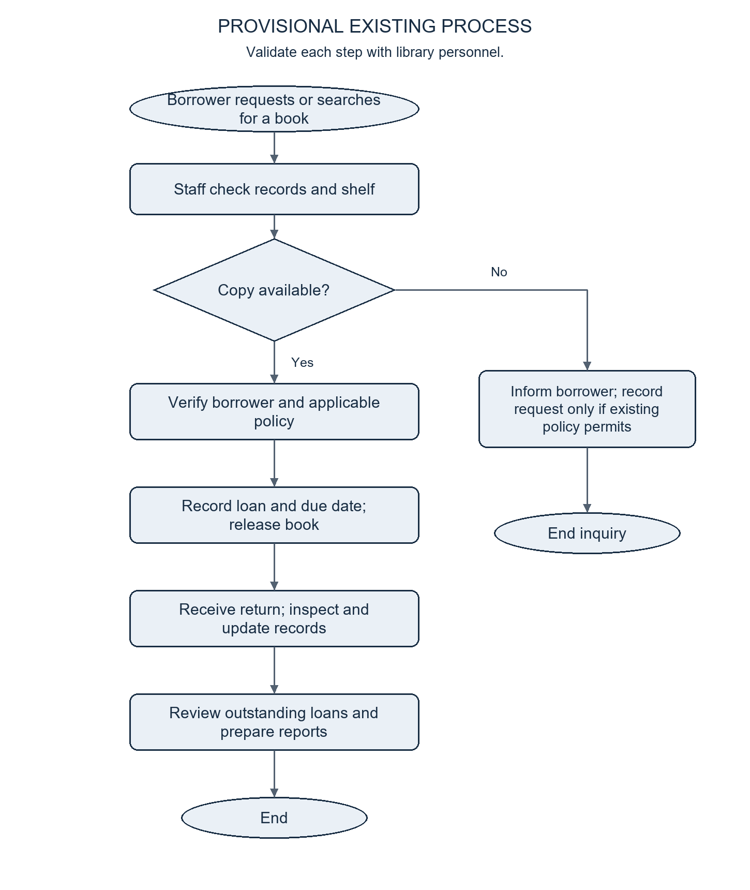

The unavailable-book branch ends with informing the borrower or recording a request under the establishment's existing policy. It must not be represented as a confirmed formal queue unless the interview and record review establish that such a queue exists. The diagram separates this baseline from the proposed electronic workflow in Chapter 3.

## Quality Issues to Observe

The researchers should observe timeliness, accuracy, consistency, accessibility of information, and traceability. For timeliness, record the time required to locate a book, record a checkout, record a return, and prepare a defined report. For accuracy, compare selected records with actual copy locations and loan states. For consistency, check whether the same eligibility and due-date rules are applied to comparable transactions.

Information accessibility should be assessed by documenting what borrowers can determine independently and which inquiries require staff assistance. Traceability should be assessed by determining whether each transaction can be connected to a borrower, a copy, a date, and the staff member responsible. Record the number of observations and the sampling conditions; isolated examples should not be presented as the library's overall error rate.

## Proposed Improvement

The proposed improvement is a centralized digital workflow that preserves staff responsibility for physical circulation while making catalog information publicly accessible. Verified library member records replace the need to treat each borrower as an online account. Copy-level loans connect each borrowing event to a specific item, while a reservation queue connects unavailable-title requests to later pickup allocations.

Configured due dates, renewal checks, automatic overdue and expiration processing, and audited state changes provide mechanisms for consistent handling. Reports and transaction history use the same underlying records, reducing the need to recreate operational summaries from separate sources. Their practical benefit should be demonstrated through the evaluation described in Chapter 3.

# CHAPTER 3 — PROPOSED SOLUTION

## System Description

The proposed solution is a web-based library reservation and circulation management application. Its principal users are library personnel who authenticate before managing collection, borrower, reservation, and loan records. Public visitors can browse the catalog without authentication. Administrators supervise role assignments and circulation settings in addition to the operational functions available to Librarians.

Library membership is represented separately from authentication. Staff register the borrower's verified physical card and relevant details in a library member record. A borrower can therefore obtain service without an email address or password. Existing verified accounts may link to these records and access personal functions, but the current interface does not invite new borrower account creation.

The system applies access rules both in the interface and in database permissions and protected operations. This design is intended to prevent unauthorized reading or modification even when a request is made outside the visible navigation. Production enforcement must still be verified through authenticated API and database access tests.

### Catalog and Borrower Registration

Visitors search or filter the catalog by identifying details, including course or subject, and view copy availability and shelf locations. Staff manage bibliographic records and register individual copies with unique barcodes. Staff also verify and record library card details, search members by identifying information, and maintain active membership status. Deactivation is restricted while active loans or holds remain.

### Reservation and Pickup Processing

A reservation is appropriate when the title has physical copies but none is available. Authorized staff can record a request for an eligible card holder; an existing linked Member account can submit its own eligible request. The system prevents duplicate active requests for the same member and title.

Waiting requests are processed in creation-time order, with the record identifier used to resolve ties. When a usable copy becomes available, the system assigns that copy to the next waiting request and marks the reservation Ready for Pickup. The copy becomes Reserved, and the reservation receives a pickup deadline. The queue is title-based, but the ready hold is copy-specific.

Checkout by the assigned borrower completes the ready reservation. Cancellation or expiration releases the copy and allows allocation to another waiting request. Staff cannot complete a reservation merely by changing a display label without the corresponding checkout operation. Titles with no physical copies are handled through staff review and, where appropriate, a separate book request rather than an unfulfillable hold.

### Book Requests and Stock Audit

The Book Requests module records unmet collection demand separately from reservations. Staff enter a requested title, optional author, course or subject, and optional requesting member. They may track the request through New, Reviewing, Ordered, Acquired, or Declined states, subject to the permitted transitions, and maintain review notes. Acquired is a request-tracking status; it does not itself create a catalog title or physical copy.

The Stock Audit module starts a snapshot of copies marked Available, Reserved, Maintenance, or Damaged. Borrowed, Overdue, and Lost copies are outside this expected shelf set. Staff scan a barcode and enter the observed location. Results distinguish found copies, wrong locations, changed status, combined discrepancies, records outside the starting snapshot, and unknown barcodes. Only one stock audit may be open at a time.

On completion, unscanned expected items are flagged for checking, with allowance for status changes during the audit. Staff review the summary before making separately authorized inventory corrections. The audit does not automatically change a copy to Lost or otherwise rewrite its circulation status.

### Borrowing, Return, and Exception Processing

For checkout, staff identify an active library member with a verified card and select or scan the physical copy. The system checks copy availability, hold ownership, and the borrower's active-loan limit. An accepted checkout creates a loan, assigns a due date, changes the copy status to Borrowed, and records an audit event. The interface displays a checkout receipt containing the transaction details.

For a normal return, staff identify the active loan, confirm the physical return, and record it. The loan becomes Returned and the copy is released. If another borrower is waiting, the copy may immediately become Reserved for that request; it does not necessarily remain Available. Lost and damaged outcomes close the loan with the corresponding status and keep the affected copy outside normal availability.

An eligible existing linked Member account can request renewal through the personal loan screen. The server rejects renewal when the loan is overdue, the renewal limit has been reached, or another reservation needs the title. These restrictions are evaluated against the loan and current circulation rules.

### Time-Based Monitoring and Notifications

The implementation contains scheduled circulation processing for overdue loans and pickup expiration. The supplied scheduling migration registers a five-minute job when the required scheduler is available; another authorized worker is needed when it is not. Staff-facing refresh operations supplement this processing. The Administrator health indicator checks a separate scheduled-success timestamp.

Fine calculation uses the daily rate captured for the loan and the elapsed overdue time. The initial rate is zero. Return, loss, or damage finalizes applicable calculations as part of loan closure. This mechanism records calculated amounts but does not record actual payments or waive financial obligations. Institutional authorization of any nonzero rate must be established separately.

Where enabled, relevant events produce in-system notifications for borrowers with linked accounts. Account-free borrowers are still served through library staff, so the library must establish how pickup and overdue information will be communicated to them.

### Proposed Operational Flow

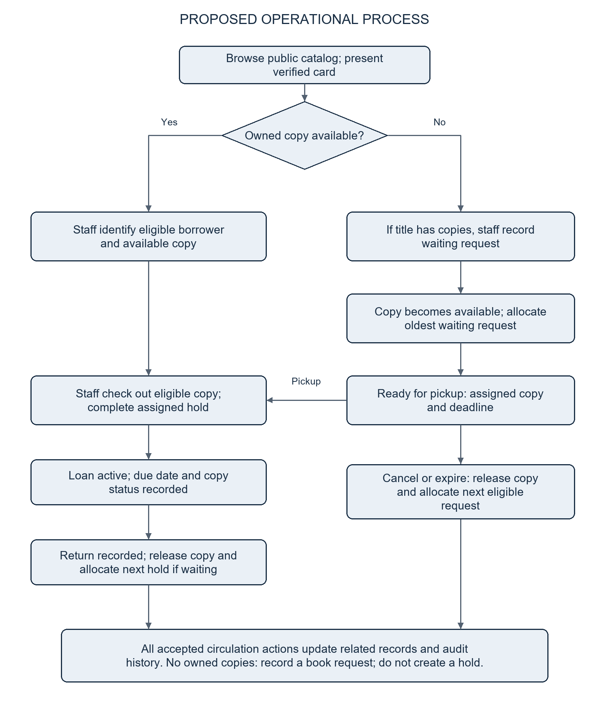

## Basis of the Proposed Solution

The solution links each identified design need to a specific operation and record. Public catalog access addresses repeated information inquiries. Staff-managed borrower records support card-based service without forcing account creation. Copy-linked loans make the inventory consequence of a checkout or return explicit. Copy-assigned holds preserve reservation order when returned materials become usable again. Audit events preserve an action history for authorized review.

These mechanisms explain why the design is relevant to the proposed problems. They do not establish that IBA currently experiences a particular error rate or that the system has already reduced it. Institutional fieldwork and evaluation remain necessary to test those claims.

| Objective | Implemented design response | Evidence required for acceptance |
| --- | --- | --- |
| 1. Public catalog | Account-free search, details, availability, and location | Search-task completion and public-data access checks |
| 2. Borrower records | Staff-managed card holders independent of login profiles | Registration, duplicate-card, and account-free checkout scenarios |
| 3. Reservations and demand | Waiting queue, assigned holds, and separate book requests | Queue-order, cancellation, expiration, pickup, and request-transition tests |
| 4. Circulation and stock audit | Copy-linked loans, audited closure, and shelf-scan reconciliation | Loan/copy/event checks plus controlled stock-audit discrepancies |
| 5. Rules and monitoring | Configured limits, due dates, renewal checks, and scheduled processing | Boundary tests, scheduler evidence, and policy approval |
| 6. Reporting | Summary counts, analytics, and searchable audit history | Comparison with controlled source records |
| 7. Access control | Roles, ownership checks, and restricted database operations | Allowed and denied actions for each access category |
| 8. Evaluation | Baseline comparison and task-based assessment | Recorded task times, errors, feedback, and test outcomes |

## Expected Improvements

The system is expected to improve access to collection information, consistency of borrower identification, organization of requests, and traceability of physical-copy movements. It is also expected to reduce repeated consolidation when producing operational summaries. The expected improvement is the practical effect of the implemented controls, not an assumed percentage increase in service quality.

Evaluation should use comparable manual and system-assisted tasks, consistent data, and documented participant roles. Measures should include task completion time, successful completion, record discrepancies, unauthorized actions rejected, and user feedback. The report should identify the number of trials and participants and explain limitations such as training effects or differences in workload. Until these observations are collected, the expected improvements remain hypotheses for evaluation.

## Users of the System

| User category | Responsibilities or access |
| --- | --- |
| Public visitor / borrower | Search the catalog and view permitted availability and shelf information without login; present a verified card to staff for circulation services. |
| Librarian | Manage books, copies, borrower records, reservations, book requests, checkout, returns, overdue monitoring, and lost/damaged closure; conduct stock audits and review reports and transactions. |
| Administrator | Perform staff operations; manage account roles and circulation settings; review administrative and scheduled-processing information. |
| Existing linked Member account | View personal loans, history, reservations, notifications, and profile; submit eligible reservations, cancellations, and renewal requests. Compatibility access only; public signup is not offered. |

# CHAPTER 4 — SYSTEM DESIGN

## Use Case Diagram

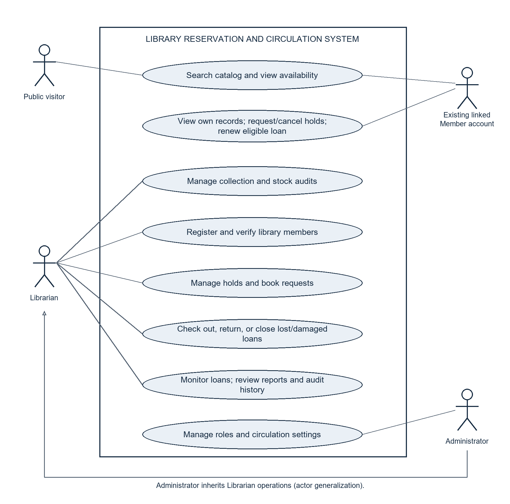

The system boundary includes catalog access, collection management, borrower registration, reservations, circulation, monitoring, reporting, and administration. The Administrator actor specializes the Librarian actor and inherits staff operations. Existing linked Member account functions are shown separately because they remain supported but are not required for card-based borrowing. Borrowers without accounts participate in desk transactions through the Librarian rather than directly operating protected circulation controls.

The diagram groups closely related use cases for readability. Checkout includes borrower eligibility and copy-assignment checks; return includes loan closure and inventory reconciliation. These details are specified in Chapter 3 rather than presented as independent user goals.

## Database Design

The database separates a bibliographic title from its physical copies and a library borrower from an authentication profile. These distinctions allow several copies of one title, several historical loans for a copy, and borrowing by people without online accounts. PostgreSQL keys, uniqueness rules, access policies, and protected transaction functions support record integrity.

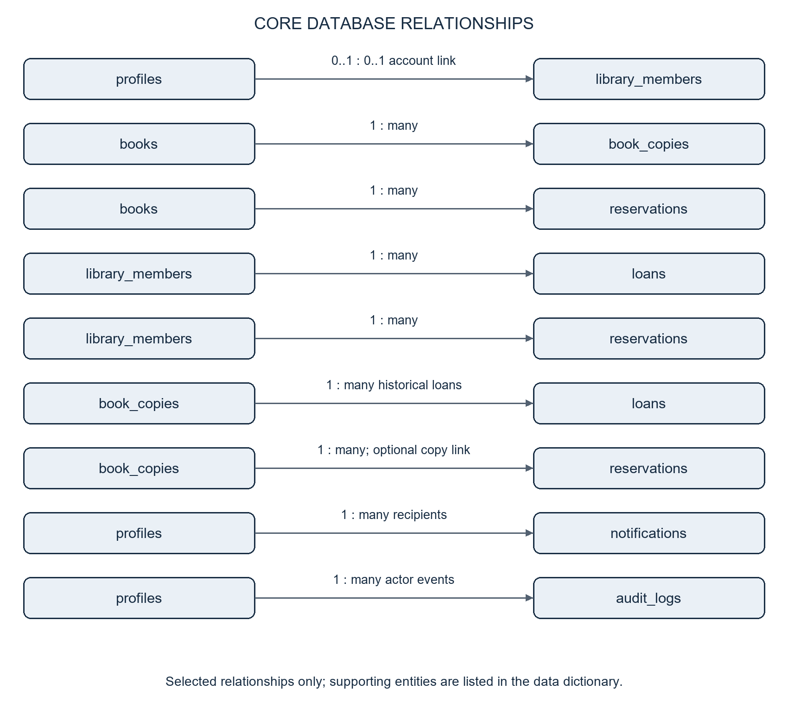

### Principal Data Entities

The following is a selected-field data dictionary aligned with the current migrations. It summarizes fields relevant to the paper rather than reproducing every implementation column. UUID identifiers are used for principal records; date-time fields store transaction and update timestamps.

| Entity | Selected fields | Purpose |
| --- | --- | --- |
| profiles | id, full_name, role, school_id, created_at, updated_at | Application identity and role for authenticated accounts; id links to Supabase Auth. |
| library_members | id, full_name, library_card_number, school_id, member_type, is_active, auth_user_id, created_by | Verified borrower records; auth_user_id is an optional account link. |
| books | id, title, author, isbn, category, course_subject, description, publication_year, cover_url | Bibliographic information shared by physical copies. |
| book_copies | id, book_id, barcode, location, condition, status | Individually identified physical items and their current condition and availability. |
| reservations | id, book_id, member_id, copy_id, status, pickup_expires_at, created_at, updated_at | Title requests; copy_id identifies an assigned hold when applicable. |
| loans | id, copy_id, member_id, checked_out_by, checked_out_at, due_at, returned_at, status, renewal_count, last_renewed_at, fine_amount, fine_daily_rate, fine_calculated_at | Copy-level borrowing, closure, renewal, and calculated fine records. |
| notifications | id, member_id, title, message, read_at, created_at | In-system messages; this member_id references profiles, not library_members. |
| audit_logs | id, actor_id, action, entity_type, entity_id, details, created_at | Recorded operations and their actors; actor_id references profiles. |
| system_settings | key, value, description, updated_at, updated_by | Configurable circulation policy values. |
| circulation_job_health | singleton, last_success_at, last_scheduled_success_at | Status-processing and scheduled-worker heartbeat information. |
| school_id_invitations | token_hash, school_id, full_name, purpose, expires_at, consumed_at, issued_by | Controlled identity/recovery invitations; public account creation is not offered. |
| school_auth_limits | bucket, starts_at, attempts | Authentication request-rate tracking. |
| book_requests | id, requested_title, requested_author, course_subject, member_id, status, staff_notes, created_by, created_at, updated_at, closed_at | Staff-recorded unmet demand and request-review progress. |
| inventory_audits | id, status, started_by, completed_by, started_at, completed_at, summary | Stock-audit sessions and completion summaries. |
| inventory_audit_items | id, audit_id, copy_id, barcode, title_snapshot, expected_status, expected_location, observed_location, status_matches, location_matches, result, scanned_at | Snapshot and scan results for each barcode in an audit. |

### Relationships and Integrity Rules

One book has many physical copies and may have many reservation records. One library member may have many loans and reservations. One physical copy may have many historical loans, but only one open loan is allowed at a time. Reservations may have an assigned copy; active pickup allocation must not assign the same copy to competing borrowers.

A profile may be linked to at most one library member through the unique optional auth_user_id relationship. A library member may have no linked profile. Profile-to-notification and profile-to-audit relationships serve authenticated recipients and action attribution. An audit entity reference describes the affected record; entity_type and entity_id are not a single ordinary foreign key to all possible target tables.

Non-null library card numbers and School IDs are constrained for uniqueness. One member cannot have duplicate active reservations for the same title. Protected operations enforce loan limits, hold ownership, valid status transitions, and eligibility. Account roles cannot be changed through an unrestricted personal-profile update.

Book requests may optionally reference a library member and retain the staff creator. Each inventory audit has many audit items; an item may link to a known copy or record an unknown barcode. The audit and barcode combination is unique within a session. The Transactions page is a derived view of audit events joined with relevant circulation, member, book, copy, and staff information. It is not a separate transactions table. Reports similarly summarize source records rather than maintain independently editable totals.

### Record States

| Record | Supported states |
| --- | --- |
| Reservation | Waiting; Ready for Pickup; Completed; Cancelled; Expired |
| Loan | Borrowed; Overdue; Returned; Lost; Damaged |
| Physical copy | Available; Reserved; Borrowed; Overdue; Lost; Damaged; Maintenance |
| Book request | New; Reviewing; Ordered; Acquired; Declined |
| Stock-audit session | In Progress; Completed |

Some stored states do not imply a complete user workflow. For example, the presence of Maintenance in the copy status list does not establish a complete repair, inspection, and restoration module. The paper's scope follows the implemented operations rather than inferring functionality from enum values alone.

## Interface Design

The interface uses school-oriented red, navy, gold, and light surfaces, with role-based navigation and status labels. The public entry page combines staff sign-in with a catalog-browsing action. The catalog presents search and filtering controls, book information, and availability. Public access omits protected borrower details and copy identifiers that are not intended for anonymous display.

The staff workspace provides navigation to Dashboard, Catalog, Books, Copies, Members, Reservations, Book Requests, Stock Audit, Borrow / Return, Overdue, Reports, Transactions, and Profile. Administrators additionally access User Management and policy controls. Searchable member and copy selection supports desk operations; explicit status messages communicate success, missing data, loading, and errors.

The Borrow / Return interface accepts card and barcode input, presents eligible selections, and displays a checkout receipt. Reservation views show request status and assigned-copy or pickup information. Transactions provide action details, search, and pagination. Destructive or exceptional actions such as marking a loan lost or damaged require confirmation in the interface and generate an audit event.

Existing Member account screens present personal loans, reservations, history, notifications, and profile information. These screens complement the account-free model without becoming a prerequisite for borrowing. Responsive layout behavior supports smaller browser windows; usability and accessibility across target devices still require user testing.

# CHAPTER 5 — SYSTEM PROTOTYPE

## Prototype Documentation

The figures in this chapter are screenshots of the actual local React interface. For safe, reproducible illustration, backend responses were supplied by browser-intercepted demonstration fixtures. Names, titles, counts, and transaction events shown are synthetic. No live library records were accessed or changed. These figures demonstrate interface presentation, not successful hosted authentication, database integration, or measured operational results.

## Login Page

The entry screen identifies the staff sign-in purpose and provides supported identifier options. Authentication loads the account profile and its role before the corresponding workspace is displayed. The page also allows catalog browsing without an account. There is no public Create Account action in the current interface; borrowers use verified library cards for desk services.

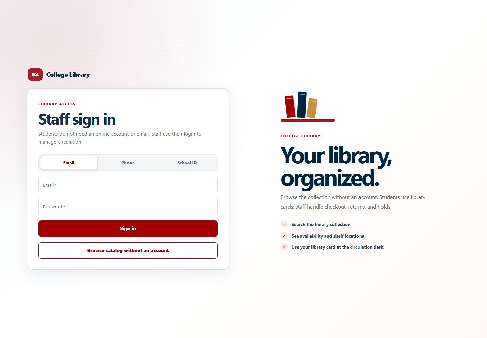

## Dashboard

The Administrator dashboard combines collection and circulation summaries, library analytics, recent activity, reservation information, and shortcuts to common operations. Displayed values should be derived from the database in normal operation. The demonstration image uses illustrative fixture values and does not represent IBA's actual collection size or transaction volume.

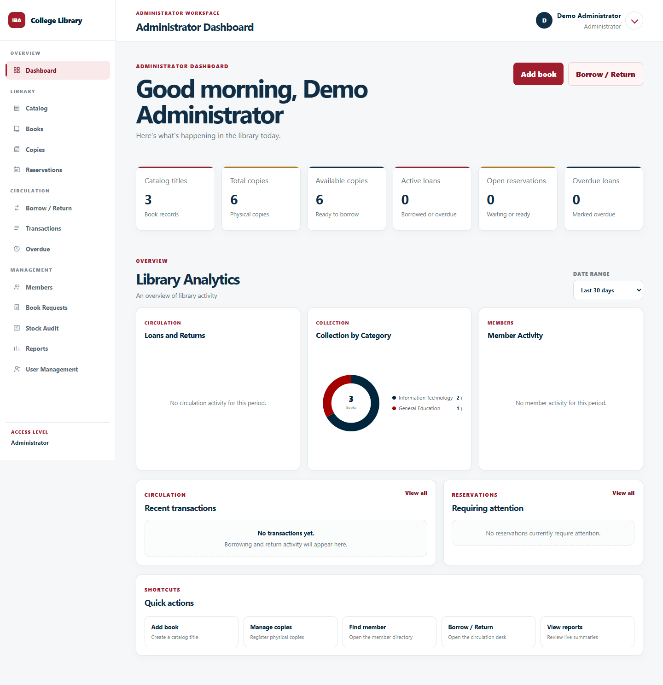

## Main Features

### Public Catalog

The catalog allows account-free searches and displays bibliographic information and permitted copy information. Its purpose is to let borrowers identify materials before requesting desk assistance. Available titles proceed to desk checkout; unavailable owned titles may qualify for the hold queue.

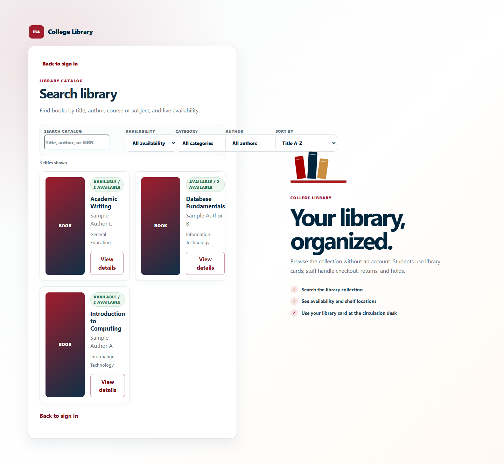

### Library Member Management

The Members module supports verified borrower registration and lookup. Physical library cards establish the desk-service identity independently of an online account. Staff are responsible for verifying entered details against the institution's accepted identification process.

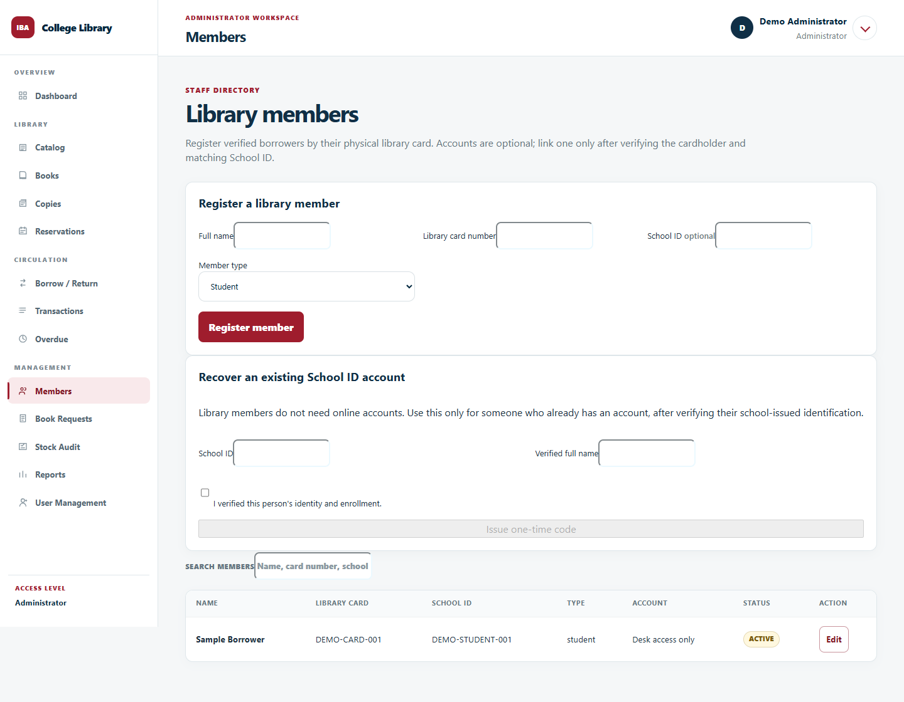

### Borrowing and Return

The circulation interface provides card or member lookup, copy-barcode entry, checkout, return lookup, and active-loan actions. Valid operations should update the loan, physical copy, related reservation, and audit history consistently. A populated form or screenshot alone does not demonstrate that these database operations succeeded.

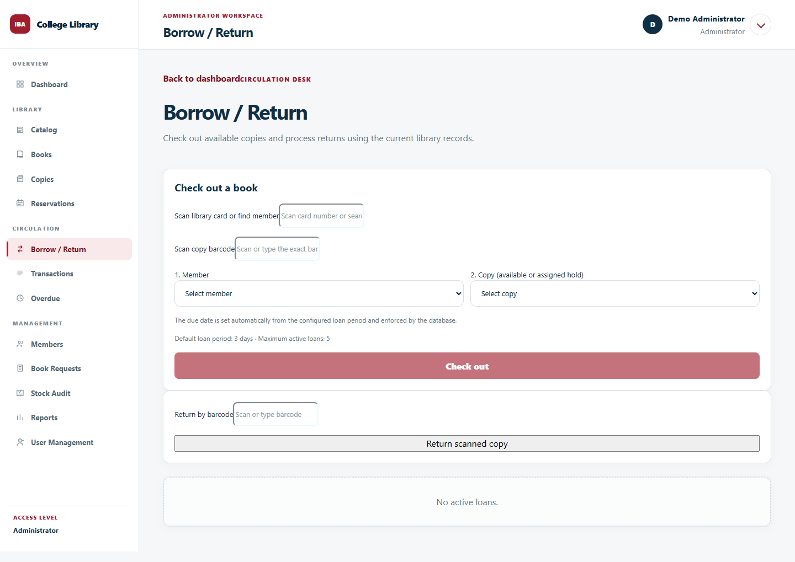

### Reservation Management

Staff manage waiting requests and monitor pickup assignments. Queue allocation and reservation completion are controlled operations, not arbitrary editing of status labels. The screenshot illustrates the interface in an empty-queue demonstration state; queue behavior requires separate functional evidence.

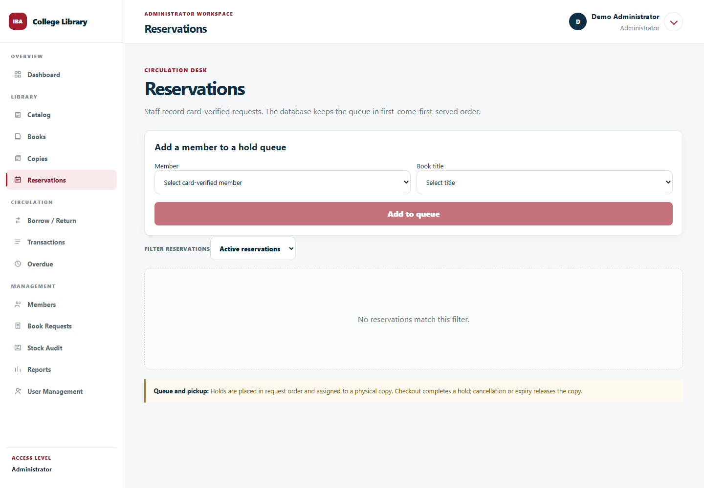

### Book Requests and Stock Audit

Book Requests records unmet demand and staff review decisions separately from owned-title holds. Stock Audit supports a controlled shelf-checking session, barcode scans, observed locations, and discrepancy summaries. These modules are present in the current source, but their database operations require controlled integration validation.

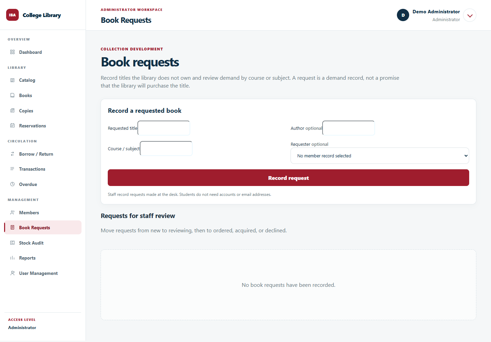

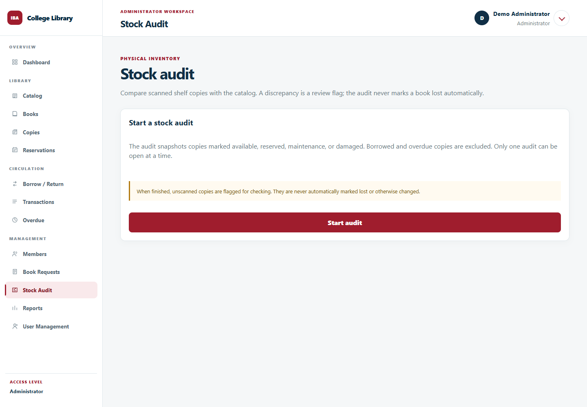

## Reports

The current Reports page presents three summary panels: catalog titles and physical copies, active loans, and waiting reservations. Active loans include Borrowed and Overdue records. These summaries differ from the Administrator dashboard's broader analytics and should be checked against the same source records. PDF or Excel export is not included in this prototype.

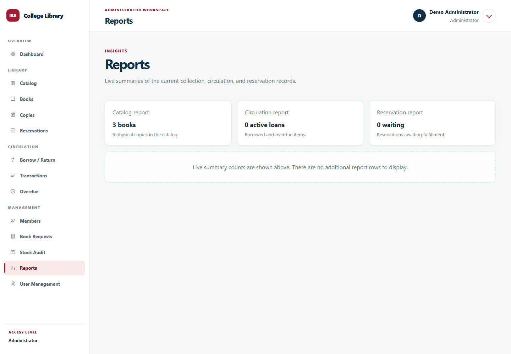

## Transactions

The Transactions page presents searchable transaction and audit history. Columns identify the event date, action, member, book or copy, staff actor, and expandable details. Server-side search and pagination support navigation through recorded events. A transaction event is distinct from the current status of a loan: one loan may produce several events over its lifecycle.

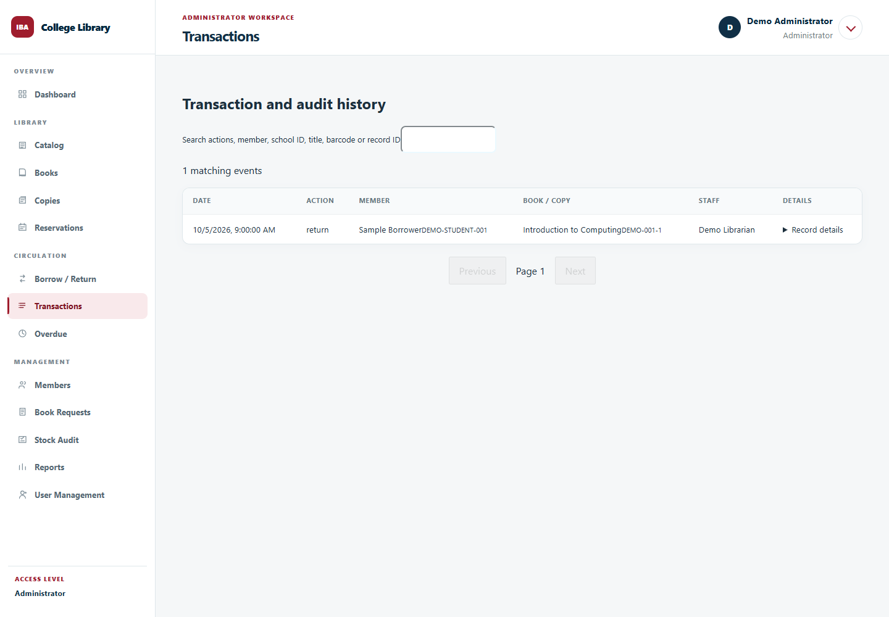

## Prototype Validation Requirements

Validation must examine outcomes in the actual test database, not only whether screens display. The following scenarios connect the prototype to the objectives. Their status in this paper is pending controlled integration and user evaluation; no pass rate is claimed.

| Scenario | Expected evidence |
| --- | --- |
| Public browsing | Catalog access succeeds without login; protected borrower and audit information is denied. |
| Card-based checkout | A verified member with no online account can borrow an eligible copy; loan, copy, and audit records agree. |
| Queue and pickup | Unavailable owned titles enter the queue; a returned copy is assigned in order; only its assignee can collect it. |
| Cancellation and expiration | Hold is closed correctly; copy is released or reassigned; applicable audit and notification records appear. |
| Return, loss, and damage | Loan and copy states agree; audit event and final fine calculation are recorded where applicable. |
| Renewal and limits | Eligible renewal succeeds; overdue, limit-exceeded, and competing-request cases are rejected. |
| Reporting | Summary counts and history match a controlled set of source records. |
| Book requests | Request creation and valid review transitions succeed; invalid transitions are rejected; catalog copies are not created implicitly. |
| Stock audit | Known, misplaced, changed-status, unscanned, and unknown copies produce appropriate review flags without automatic inventory-state changes. |
| Role and ownership restrictions | Public and Member requests cannot perform staff operations; only Administrators can change roles and policies. |
| Scheduled processing | A real scheduler runs without a staff screen visit; its heartbeat and overdue/expiration outcomes are recorded. |
| User evaluation | Participants complete defined tasks; times, errors, and feedback are documented against the baseline. |

# CHAPTER 6 — CONCLUSION AND RECOMMENDATIONS

## Conclusion: How the System Supports Quality Improvement

The developed source implementation provides a centralized design for public catalog access and staff-managed library reservation and circulation. It separates physical library membership from online authentication, allowing borrowers to receive desk service without creating an account. It also separates book titles from physical copies, enabling each checkout, return, and exception to be associated with an identifiable item.

The system supports record consistency through validated circulation operations, copy-specific pickup holds, controlled role assignments, and audit events. Configurable due dates, loan limits, renewal checks, overdue processing, and pickup expiration provide mechanisms for applying library rules consistently once those rules are confirmed. Reports and searchable transaction history provide a common basis for reviewing collection and circulation information.

These features explain how the system can improve quality: information is easier to locate, borrower and copy responsibilities are clearer, reservation order is explicit, and operational actions are traceable. However, the present documentation does not establish a measured reduction in waiting time, record errors, or reporting effort. The current-process baseline requires institutional validation, and the demonstration screenshots do not substitute for live integration or acceptance testing.

The defensible conclusion at this stage is that the design and prototype contain mechanisms aligned with the stated operational objectives. Objective 8, the evaluation of actual improvement, remains to be completed through documented fieldwork, controlled system tests, and user assessment. Claims of achieved service improvement should be added only when those results are available.

## Recommendations

Before institutional use, library personnel should confirm the existing process and approve the borrowing period, loan limit, renewal conditions, pickup deadline, and any fine policy. The team should reconcile the deployment database with the intended migrations, verify role and ownership restrictions in the hosted environment, confirm scheduled processing, and complete user acceptance and backup-restoration exercises. These are completion requirements for adoption rather than optional new features.

Future enhancements may include the following:

1. Add exportable and printable operational reports, including date-range filters and PDF or spreadsheet output.
2. Add an approved borrower contact and reminder workflow suitable for people without online accounts. Email or SMS reminders should use verified contact details and a defined institutional communication policy.
3. Add a complete fine payment and waiver ledger, with authorized adjustments, receipts, and reconciliation, if the institution adopts monetary penalties.
4. Extend lost and damaged processing and stock-audit findings with repair, inspection, replacement, authorized discrepancy resolution, and controlled restoration to circulation.
5. Extend Book Requests with a complete acquisitions workflow covering approval, vendors, purchasing, receiving, and controlled catalog/copy creation.
6. Integrate verified school records where authorized, reducing repeated borrower entry while retaining clear staff responsibility for card verification.
7. Add server-side collection search and filtering for larger datasets, guided by measured workload and response-time tests.
8. Improve accessibility and device usability through keyboard, screen-reader, and mobile-browser testing with representative users.
9. Extend barcode workflows with supported label printing or camera scanning if these capabilities are required by actual desk operations.
10. Establish periodic restore drills, external scheduler monitoring, and routine record-reconciliation reports to support sustained operation.

Automatic overdue processing, renewal limits, pickup expiration, queue positions, barcode-input circulation, lost/damaged closure, book-request tracking, and stock-audit sessions should not be listed as wholly new future features because implementations already exist. Future work should extend or validate these capabilities rather than contradict the present scope.
